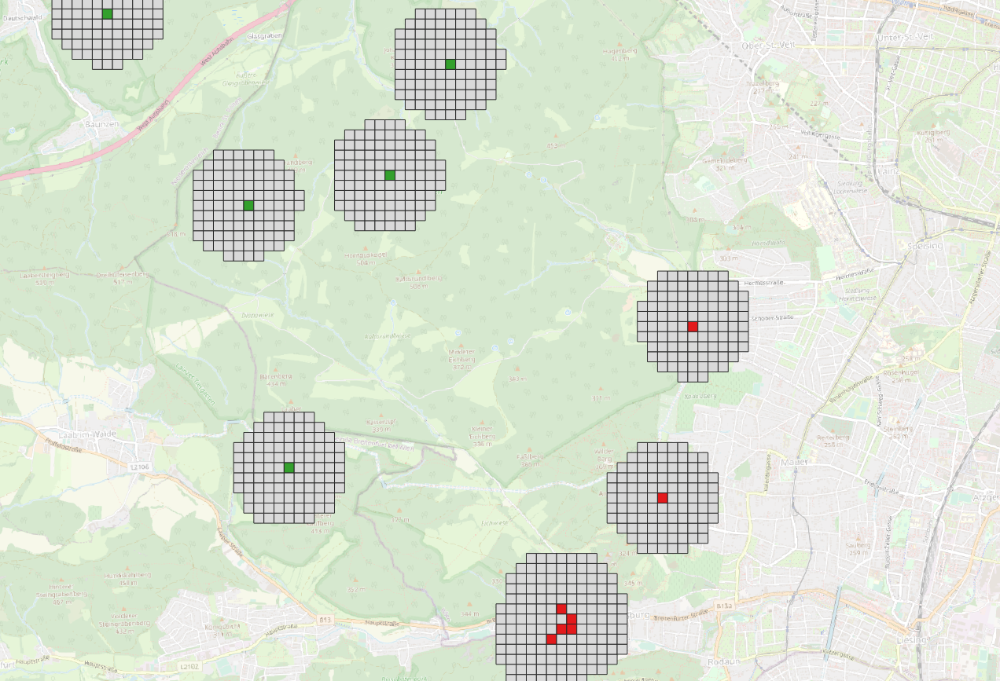

# geokg-fire-prediction

This repository contains the code for utilizing a GeoKnowledge Graph and ML for wildfire prediction in Austria.

### Set-Up

Creat an .env file in the project root directoy and define variables for GraphDB connection

```
GRAPHDB_BASE_URL=http://<IP>:<Port>
REPO_ID=<GrahpDB Repo>
GRAPHDB_USERNAME=<GraphDB Username>
GRAPHDB_PASSWORD<GraphDB PW>
```

### Data Preparation

#### Transform fire cells to RDF

In the first step we want to transfor the austrian forest fire ignition data (FFID) to RDF.
The FFID is point data, containing the date of the fire, the location and the spatial uncertainty of the location as radius.
In previous steps we have added random non-fire points to this dataset to get a balanced sample for ML purposes.
Furthermore, we have prepared a 1000x1000 meter reference grid.

The overall task is to transform the FFID to RDF, containing geometries (of 100x100m square polygons, in which the fire location lies), neignoring cells, and some further attributes (location uncertainty, date).

The following steps are executed to retrieve the RDF file, representing the FFID (and neighbors)

1. Load fire-non-fire-points
2. Create 1000 m buffers
3. Extract all grid cells from the 1000x1000m grid, which intersect with the Buffers
4. Divide extracted grid cells into cell of 100x100m resolution
5. Join 100x100m grid cells with fire-non-fire points.
6. Transform to EPSG:4326 and save as shp

The code of these steps can be viewed [here](src/knowledge_graph/transform_fire_data_to_rdf.py)

The following image shows the fire cells, and their neighboring pixels.

<p align="center">
  
</p>

The following turtle snippet, represents the structure of our final RDF graph.

```
fire_austria:Cell_1411 a fire_austria:Cell ;
    fire_austria:hasNeighbor fire_austria:Cell_1403,
        fire_austria:Cell_1404,
        fire_austria:Cell_1405,
        fire_austria:Cell_1410,
        fire_austria:Cell_1412,
        fire_austria:Cell_1417,
        fire_austria:Cell_1418,
        fire_austria:Cell_1419 ;
    geo:hasGeometry fire_austria:Geom_Cell_1411 .

fire_austria:Cell_1412 a fire_austria:Cell ;
    fire_austria:date "2007-04-14"^^xsd:date ;
    fire_austria:fire true ;
    fire_austria:hasNeighbor fire_austria:Cell_1404,
        fire_austria:Cell_1405,
        fire_austria:Cell_1406,
        fire_austria:Cell_1411,
        fire_austria:Cell_1413,
        fire_austria:Cell_1418,
        fire_austria:Cell_1419,
        fire_austria:Cell_1420 ;
    geo:hasGeometry fire_austria:Geom_Cell_1412 .
```

#### Transform OSM-Snapshot to RDF

Our final Knowledge-Graph will consist of two datasets the previously transformed FFID and a snapshot of the OSM.
Therefore the OSM snapshot must be transformed into triplets. The following repostory provides a guide as well as the code 
for transforming OSM-Data to RDF-Triplets:
https://github.com/alishiba14/WorldKG-Knowledge-Graph/tree/main
Though not all of the steps are required as the code is already contained in the OSM_to_RDF folder of this repository.

- Open a terminal and switch to the OSM_to_RDF directory
- Get a snapshot of the OSM in oms.pbf format. 
  - Download the snapshot of a whole country from geofabrik: https://download.geofabrik.de/
  - Extract a more detailed snapshot from an existing osm.pbf file using osmosis command line tool. 
    -  Instructions on installing Osmosis can be found on: https://wiki.openstreetmap.org/wiki/Osmosis
    - Once osmosis is installed use the createOSMSnapshot.sh script to extract the subset from your osm.pbf file (Adjust data paths as suited)
  - Then use the createTriples.sh file to create a python environment and run the createTriples.py script to generate the worldKG snapshot as .ttl file.
  - Upload this .ttl-file to your GraphDB


### TODOs

- Upload of fire data turtle file (subset) to GraphDB
- Upload of worldkg graph subset to GraphDB
- Create connections between fire cells and osm entities
- GNN Development
