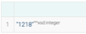
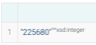

# 1 IGNITE_KGAI Queries

Situtation:
- GraphDB database containing WorldKG for Austria (OSM-Data) and Fire raster cells as nodes with attributes

## Query 1 - Query all neighbors of a given firecell
```sparksql
PREFIX fire_austria: <http://example.org/fire_austria_ns#>
PREFIX geo: <http://www.opengis.net/ont/geosparql#>
SELECT ?neighb ?geom
WHERE {
    fire_austria:Cell_15000 a fire_austria:Cell ;
                        fire_austria:hasNeighbor ?neighb .
    ?neighb geo:hasGeometry ?geom_ent .
    ?geom_ent geo:asWKT ?geom .
}
```

## Query 2 - Query all cells that have the attribute fire
```sparksql
PREFIX fire_austria: <http://example.org/fire_austria_ns#>
PREFIX geo: <http://www.opengis.net/ont/geosparql#>
SELECT ?cell ?geom
WHERE {
    ?cell a fire_austria:Cell ;
          fire_austria:fire True ; 
          geo:hasGeometry ?geom_ent .
    ?geom_ent geo:asWKT ?geom .
}
LIMIT 100
```

## Query 3 - Count Cells with and without fire ignition event and cells without attribute fire

### Query 3.1 - Count Cells without fire ignition event
```sparksql
PREFIX fire_austria: <http://example.org/fire_austria_ns#>
PREFIX geo: <http://www.opengis.net/ont/geosparql#>
SELECT (count(?cell) as ?count)
WHERE {
    ?cell a fire_austria:Cell ;
          fire_austria:fire FALSE ; 
          geo:hasGeometry ?geom_ent .
    ?geom_ent geo:asWKT ?geom .
}
LIMIT 100
```


### Query 3.2 - Count Cells with fire ignition event
```sparksql
PREFIX fire_austria: <http://example.org/fire_austria_ns#>
PREFIX geo: <http://www.opengis.net/ont/geosparql#>
SELECT (count(?cell) as ?count)
WHERE {
    ?cell a fire_austria:Cell ;
          fire_austria:fire True ; 
          geo:hasGeometry ?geom_ent .
    ?geom_ent geo:asWKT ?geom .
}
LIMIT 100
```


### Query 3.3 - Count Cells without attribute fire
```sparksql
PREFIX fire_austria: <http://example.org/fire_austria_ns#>
PREFIX geo: <http://www.opengis.net/ont/geosparql#>
SELECT (count(?cell) as ?count)
WHERE {
    ?cell a fire_austria:Cell ;
          geo:hasGeometry ?geom_ent .
    ?geom_ent geo:asWKT ?geom .
}
LIMIT 100
```


## Query 4 - Query all WorldKG geometries, labels & types that are within a 0.5 degree buffer of a firecell
```sparksql
PREFIX wkgs: <http://www.worldkg.org/schema/>
PREFIX geo: <http://www.opengis.net/ont/geosparql#>
PREFIX geof: <http://www.opengis.net/def/function/geosparql/>
PREFIX fire_austria: <http://example.org/fire_austria_ns#>
PREFIX dcterms: <http://purl.org/dc/terms/>
PREFIX rdfs: <http://www.w3.org/2000/01/rdf-schema#>
PREFIX rdf: <http://www.w3.org/1999/02/22-rdf-syntax-ns#>

SELECT ?osmEntity ?osmEntityWKT ?label ?type ?fireCellGeom ?buffer
WHERE {
  ?osmEntity wkgs:spatialObject [geo:asWKT ?osmEntityWKT] ;
     rdfs:label ?label ;
     rdf:type ?type .
    
  fire_austria:Cell_10000 geo:hasGeometry [geo:asWKT ?fireCellGeom] .

  FILTER (geof:sfWithin(?osmEntityWKT, geof:buffer(?fireCellGeom, 0.5)))  
}
LIMIT 100
```

## Query 5 - Get all WorldKG geometries, labels & types intersecting a 0.5 degree buffer of a firecell
```sparksql
PREFIX wkgs: <http://www.worldkg.org/schema/>
PREFIX geo: <http://www.opengis.net/ont/geosparql#>
PREFIX geof: <http://www.opengis.net/def/function/geosparql/>
PREFIX fire_austria: <http://example.org/fire_austria_ns#>
PREFIX dcterms: <http://purl.org/dc/terms/>
PREFIX rdfs: <http://www.w3.org/2000/01/rdf-schema#>
PREFIX rdf: <http://www.w3.org/1999/02/22-rdf-syntax-ns#>
PREFIX sf: <http://www.opengis.net/ont/sf#>

SELECT ?osmEntity ?osmEntityWKT ?label ?type ?fireCellGeom
WHERE {
    ?osmEntity wkgs:spatialObject ?spatialObject;
     rdfs:label ?label ;
     rdf:type ?type .
    
  ?spatialObject geo:asWKT ?osmEntityWKT .
    
#  ?firecell a fire_austria:Cell ; 
  fire_austria:Cell_100 geo:hasGeometry [geo:asWKT ?fireCellGeom] .

  FILTER (geof:sfIntersects(?osmEntityWKT, geof:buffer(?fireCellGeom, 0.5)))  

}
LIMIT 10
```

## Query 6- Insert Intersection Relationship into KG for one firecell

```sparksql
PREFIX wkgs: <http://www.worldkg.org/schema/>
PREFIX geo: <http://www.opengis.net/ont/geosparql#>
PREFIX geof: <http://www.opengis.net/def/function/geosparql/>
PREFIX fire_austria: <http://example.org/fire_austria_ns#>
PREFIX dcterms: <http://purl.org/dc/terms/>
PREFIX rdfs: <http://www.w3.org/2000/01/rdf-schema#>
PREFIX rdf: <http://www.w3.org/1999/02/22-rdf-syntax-ns#>
PREFIX sf: <http://www.opengis.net/ont/sf#>

INSERT {
    fire_austria:Cell_100 fire_austria:intersect ?osmEntity 
}
WHERE {
    ?osmEntity wkgs:spatialObject ?spatialObject;
     rdfs:label ?label ;
     rdf:type ?type .
    
  ?spatialObject geo:asWKT ?osmEntityWKT .
    
  fire_austria:Cell_100 geo:hasGeometry [geo:asWKT ?fireCellGeom] .

  FILTER (geof:sfIntersects(?osmEntityWKT, geof:buffer(?fireCellGeom, 0.5)))  

}
```


